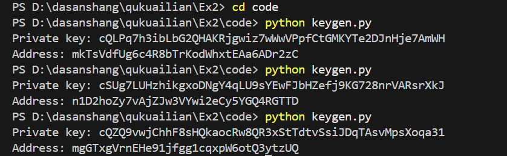
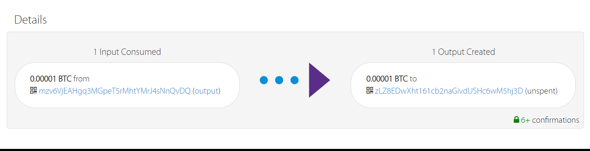
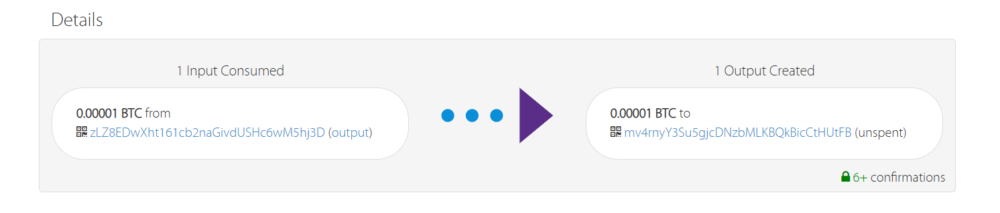

## 生成私钥与地址

打开 keygen.py，生成三对不同的私钥和地址作为另外三方客户。

```
Private key: cQLPq7h3ibLbG2QHAKRjgwiz7wWwVPpfCtGMKYTe2DJnHje7AmWH
Address: mkTsVdfUg6c4R8bTrKodWhxtEAa6ADr2zC

Private key: cSUg7LUHzhikgxoDNgY4qLU9sYEwFJbHZefj9KG728nrVARsrXkJ
Address: n1D2hoZy7vAjZJw3VYwi2eCy5YGQ4RGTTD

Private key: cQZQ9vwjChhF8sHQkaocRw8QR3xStTdtvSsiJDqTAsvMpsXoqa31
Address: mgGTxgVrnEHe91jfgg1cqxpW6otQ3ytzUQ
```



## 修改 Ex2a.py

填入上述私钥，另外修改txid_to_spend为实验一对应分币后的txid。

具体输出结果见result/ex2a_output.txt 。

查看结果发现交易(475fde844f1a913c17d8edada6cc855b13d6d3d0330edea1f9945b5eac51b490)，成功。



## 修改 Ex2b.py

要完成 bitcoin 的赎回工作。

补全multisig_scriptSig。

填写txid(475fde844f1a913c17d8edada6cc855b13d6d3d0330edea1f9945b5eac51b490)。

具体结果见result/ex2b_output.txt 。

查看结果发现交易(79d09956bc463468ec8ef5cebf172874b151547385271a8ef538c0863e256987)成功。



## 说明

代码见code文件夹，图片见pic文件夹，输出结果见result文件夹。

github仓库：[实验二仓库](https://github.com/AAAJohnAAA/Blockchain2025/tree/main/Ex2)