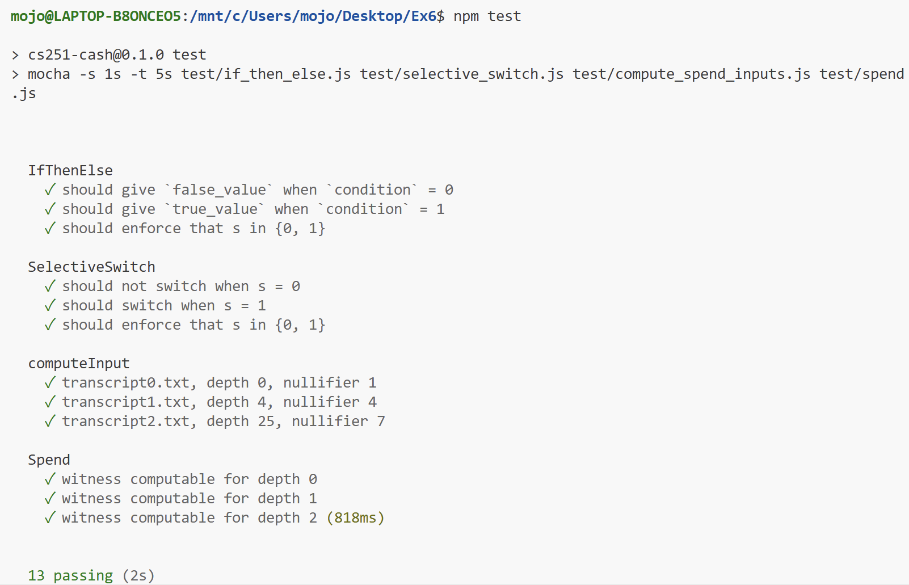
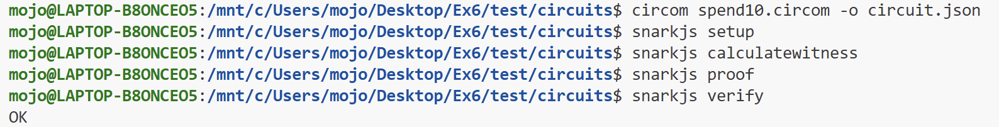

# 1 安装程序

我的 Ubuntu 版本为 **24.04.3 LTS**（满足实验要求的 Ubuntu 20.04 及以上版本）

```bash
mojo@LAPTOP-B8ONCEO5:/mnt/c/Users/mojo/Desktop/Ex6$ cat /etc/os-release
PRETTY_NAME="Ubuntu 24.04.3 LTS"
NAME="Ubuntu"
VERSION_ID="24.04"
VERSION="24.04.3 LTS (Noble Numbat)"
VERSION_CODENAME=noble
ID=ubuntu
ID_LIKE=debian
HOME_URL="https://www.ubuntu.com/"
SUPPORT_URL="https://help.ubuntu.com/"
BUG_REPORT_URL="https://bugs.launchpad.net/ubuntu/"
PRIVACY_POLICY_URL="https://www.ubuntu.com/legal/terms-and-policies/privacy-policy"
UBUNTU_CODENAME=noble
LOGO=ubuntu-logo
```


在 VS Code 的 WSL Ubuntu 终端中，安装 Node.js 和 npm

```bash
sudo apt update  # 更新软件源索引
sudo apt install -y nodejs npm  # 安装Node.js和npm
```

安装完成后，验证是否安装成功：

```bash
mojo@LAPTOP-B8ONCEO5:/mnt/c/Users/mojo/Desktop/Ex6$ node -v                                          
v18.19.1                                                                                             
mojo@LAPTOP-B8ONCEO5:/mnt/c/Users/mojo/Desktop/Ex6$ npm -v
9.2.0
```


安装 snarkjs

```bash
sudo npm install -g snarkjs@0.1.11
```

安装完成后，验证是否安装成功：

```bash
mojo@LAPTOP-B8ONCEO5:/mnt/c/Users/mojo/Desktop/Ex6$ snarkjs --version
0.1.11
```


安装 circom（指定分支 cs251，确保与实验兼容）

```bash
sudo npm install -g alex-ozdemir/circom#cs251
```

安装完成后，验证是否安装成功：

```bash
mojo@LAPTOP-B8ONCEO5:/mnt/c/Users/mojo/Desktop/Ex6$ circom --version
0.0.30
```


安装 mocha 测试工具（用于后续运行实验单元测试）

```bash
sudo npm install -g mocha
```

安装完成后，验证是否安装成功：

```bash
mojo@LAPTOP-B8ONCEO5:/mnt/c/Users/mojo/Desktop/Ex6$ mocha --version
11.7.5
```


在 Ex6 文件夹中安装项目本地依赖（实验打包的依赖库）。

```bash
npm install
```

该命令会读取 Ex6 文件夹中的 `package.json` 文件，安装实验预先打包的依赖库（无需从 GitHub 单独下载，避免原实验的高失败率问题）。

运行 `npm test` 验证环境配置，确认工具和依赖是否正常工作。

```bash
mojo@LAPTOP-B8ONCEO5:/mnt/c/Users/mojo/Desktop/Ex6$ npm test

> cs251-cash@0.1.0 test
> mocha -s 1s -t 5s test/if_then_else.js test/selective_switch.js test/compute_spend_inputs.js test/spend.js


  IfThenElse
    1) should give `false_value` when `condition` = 0
    2) should give `true_value` when `condition` = 1
    3) should enforce that s in {0, 1}

  SelectiveSwitch
    4) should not switch when s = 0
    5) should switch when s = 1
    6) should enforce that s in {0, 1}

  computeInput
    7) transcript0.txt, depth 0, nullifier 1
    8) transcript1.txt, depth 4, nullifier 4
    9) transcript2.txt, depth 25, nullifier 7

  Spend
    ✓ witness computable for depth 0
    ✓ witness computable for depth 1
    ✓ witness computable for depth 2
    10) witness not computable for bad input


  3 passing (247ms)
  10 failing

  1) IfThenElse
       should give `false_value` when `condition` = 0:
     Error: Signal not assigned: main.out
      at calculateWitness (node_modules/snarkjs/src/calculateWitness.js:63:19)
      at Circuit.calculateWitness (node_modules/snarkjs/src/circuit.js:59:16)
      at Context.<anonymous> (test/if_then_else.js:25:30)
      at process.processImmediate (node:internal/timers:476:21)

  2) IfThenElse
       should give `true_value` when `condition` = 1:
     Error: Signal not assigned: main.out
      at calculateWitness (node_modules/snarkjs/src/calculateWitness.js:63:19)
      at Circuit.calculateWitness (node_modules/snarkjs/src/circuit.js:59:16)
      at Context.<anonymous> (test/if_then_else.js:35:30)
      at process.processImmediate (node:internal/timers:476:21)

  3) IfThenElse
       should enforce that s in {0, 1}:

      Expected non-binary s to violate constraints
      + expected - actual

      -Signal not assigned: main.out
      +Constraint doesn't match

      at Context.<anonymous> (test/if_then_else.js:45:58)
      at process.processImmediate (node:internal/timers:476:21)

  4) SelectiveSwitch
       should not switch when s = 0:
     Error: Signal not assigned: main.out0
      at calculateWitness (node_modules/snarkjs/src/calculateWitness.js:63:19)
      at Circuit.calculateWitness (node_modules/snarkjs/src/circuit.js:59:16)
      at Context.<anonymous> (test/selective_switch.js:25:30)
      at process.processImmediate (node:internal/timers:476:21)

  5) SelectiveSwitch
       should switch when s = 1:
     Error: Signal not assigned: main.out0
      at calculateWitness (node_modules/snarkjs/src/calculateWitness.js:63:19)
      at Circuit.calculateWitness (node_modules/snarkjs/src/circuit.js:59:16)
      at Context.<anonymous> (test/selective_switch.js:36:30)
      at process.processImmediate (node:internal/timers:476:21)

  6) SelectiveSwitch
       should enforce that s in {0, 1}:

      Expected non-binary s to violate constraints
      + expected - actual

      -Signal not assigned: main.out0
      +Constraint doesn't match

      at Context.<anonymous> (test/selective_switch.js:47:58)
      at process.processImmediate (node:internal/timers:476:21)

  7) computeInput
       transcript0.txt, depth 0, nullifier 1:

      AssertionError: expected {} to deeply equal { …(3) }
      + expected - actual

      -{}
      +{
      +  "digest": "322312280540935210785646262942970941213230064170052589816258546769338952429"     
      +  "nonce": "17"
      +  "nullifier": "1"
      +}

      at Context.<anonymous> (test/compute_spend_inputs.js:29:71)
      at process.processImmediate (node:internal/timers:476:21)

  8) computeInput
       transcript1.txt, depth 4, nullifier 4:

      AssertionError: expected {} to deeply equal { …(11) }
      + expected - actual

      -{}
      +{
      +  "digest": "7156595577437608543190201695561556177504424919525785911637562183334393590048"    
      +  "direction[0]": "1"
      +  "direction[1]": "1"
      +  "direction[2]": "0"
      +  "direction[3]": "0"
      +  "nonce": "14"
      +  "nullifier": "4"
      +  "sibling[0]": "3"
      +  "sibling[1]": "19681602856558162950057707481888122737605614522678761875609416502251241175621"
      +  "sibling[2]": "4949757766996550399175443158059310394257309534281238094727193345225681506852"
      +  "sibling[3]": "18633364347856320646884886547836821398229701470730139821384419637975014912921"
      +}

      at Context.<anonymous> (test/compute_spend_inputs.js:29:71)
      at process.processImmediate (node:internal/timers:476:21)

  9) computeInput
       transcript2.txt, depth 25, nullifier 7:

      AssertionError: expected {} to deeply equal { …(53) }
      + expected - actual

      -{}
      +{
      +  "digest": "12008438219023705767548476986097257442459718653812944591700422139092737647616"   
      +  "direction[0]": "0"
      +  "direction[10]": "0"
      +  "direction[11]": "0"
      +  "direction[12]": "0"
      +  "direction[13]": "0"
      +  "direction[14]": "0"
      +  "direction[15]": "0"
      +  "direction[16]": "0"
      +  "direction[17]": "0"
      +  "direction[18]": "0"
      +  "direction[19]": "0"
      +  "direction[1]": "1"
      +  "direction[20]": "0"
      +  "direction[21]": "0"
      +  "direction[22]": "0"
      +  "direction[23]": "0"
      +  "direction[24]": "0"
      +  "direction[2]": "1"
      +  "direction[3]": "0"
      +  "direction[4]": "0"
      +  "direction[5]": "0"
      +  "direction[6]": "0"
      +  "direction[7]": "0"
      +  "direction[8]": "0"
      +  "direction[9]": "0"
      +  "nonce": "17"
      +  "nullifier": "7"
      +  "sibling[0]": "0"
      +  "sibling[10]": "18282053668740841793538385484375298138297506270747903022149301437302461790269"
      +  "sibling[11]": "11854931242116648486981320255420813279877710904852643395113277376779758855098"
      +  "sibling[12]": "9381451415888087631316092497966048521515156819026912291039253890498276841218"
      +  "sibling[13]": "12100772402100122546174508383775022952488245732542301225643449270292781349246"
      +  "sibling[14]": "11678712791072686349426619739236716758901691981625860855979566582851944885050"
      +  "sibling[15]": "3770348298675346367043162266532824235411923189155139302762981231467086905777"
      +  "sibling[16]": "15393217232339109119447654107682029415590614055737384965585789826144870052964"
      +  "sibling[17]": "12264910519433830970373596092952995265084876820351049594390604200874182660748"
      +  "sibling[18]": "13210202697341541829004339447849238228437591615691467850843528694875750643668"
      +  "sibling[19]": "12275175546571410475065038446548306212751740664852829804344756202168280893476"
      +  "sibling[1]": "12189038830210795421670700154279045415080606790787559391259916858881301644792"
      +  "sibling[20]": "11260233943172690917153305792393889153843582237797805965260892635012622603738"
      +  "sibling[21]": "2961348222531884875876351277329553867656725922678488160549612425483901069836"
      +  "sibling[22]": "19422277424773577396487364828210371594978232971749498960597640771480769104504"
      +  "sibling[23]": "21441775425524591870038545453134036680101698299599460058222532069207657753639"
      +  "sibling[24]": "11649977709137748592205755176624485867846310258853416849643547130466466234844"
      +  "sibling[2]": "458006536376401925134706847632908249386803523308752072267916752010455047876" 
      +  "sibling[3]": "18633364347856320646884886547836821398229701470730139821384419637975014912921"
      +  "sibling[4]": "1428163557486472957671755266439110187892884941794525091690272793864921825097"
      +  "sibling[5]": "19187735370145708415164400941549267147777572879769686202539715761761805515060"
      +  "sibling[6]": "1354502918524251823186298550250875206163022924074772172859405589330217709272"
      +  "sibling[7]": "5177479716332055346633334667550188310219858116800539706838435929857232894550"
      +  "sibling[8]": "2339305980315949773396963743270218668182561894986101180771293554269664783865"
      +  "sibling[9]": "10931860064776657815956113554498305834898340788173502696934655289858000589974"
      +}

      at Context.<anonymous> (test/compute_spend_inputs.js:29:71)
      at process.processImmediate (node:internal/timers:476:21)

  10) Spend
       witness not computable for bad input:
     AssertionError: Expected bad inputs to crash witness computation: expected [Function] to throw Error
      at Context.<anonymous> (test/spend.js:33:58)

```

测试结果符合预期：**3 个测试通过，10 个测试失败**，说明环境配置已完全成功（失败的测试均依赖未实现的电路和函数，属于正常情况）！


# 2 了解circom

**1、回答 artifacts/writeup.md 中的相关问题**

> **（完成 `artifacts/writeup.md` 中的相关问题）**


**2、为 `7×17×19=2261` 创建因子分解证明**

步骤 1：编译电路为 JSON 格式

```bash
circom ./circuits/example.circom -o ./artifacts/circuit.json
```

步骤 2：复制电路文件到当前主目录

实验报告提到 “snarkjs setup 需要 json 文件在主目录”，执行以下命令复制：

```bash
cp ./artifacts/circuit.json ./
```

步骤 3：生成 SNARK 密钥对（proving_key + verification_key）

执行以下命令初始化 setup：

```bash
snarkjs setup
```

snarkjs 会自动读取当前目录的 `circuit.json`，生成 `proving_key.json`（证明密钥）和 `verification_key.json`（验证密钥）。

步骤 4：创建输入文件 `input.json`（指定因子和乘积）

```json
{
  "product": 2261,
  "factors": [7, 17, 19]
}
```

步骤 5：计算见证（witness）

执行以下命令生成见证文件：

```bash
snarkjs calculatewitness
```

- 命令说明：自动读取 `circuit.json` 和 `input.json`，生成 `witness.json`（包含所有信号的计算结果）。
- 成功标志：执行 `ls witness.json` 能看到文件（无 “不存在” 提示）。

步骤 6：生成因子分解证明

执行以下命令生成证明：

```bash
snarkjs proof
```

- 命令说明：读取 `proving_key.json` 和 `witness.json`，生成 `proof.json`（证明文件）和 `public.json`（公开输入输出）。
- 成功标志：当前目录下新增 `proof.json` 和 `public.json`，执行 `ls proof.json` 能看到文件。

步骤 7：验证证明

执行命令`snarkjs verify`验证证明，终端输出 `OK`（表示证明有效）

<center>
 
</center> 

步骤 8：按实验要求保存文件到 artifacts

执行以下命令，将密钥和证明按实验要求命名并移动到 `artifacts` 文件夹：

```bash
# 移动验证密钥，命名为verifier_key_factor.json（实验要求的文件名）
mv verification_key.json ./artifacts/verifier_key_factor.json
# 移动证明文件，命名为proof_factor.json（实验要求的文件名）
mv proof.json ./artifacts/proof_factor.json
```


# 3 开关电路

```circom
template IfThenElse() {
    signal input condition;
    signal input true_value;
    signal input false_value;
    signal output out;

    // 辅助信号：构建线性约束，符合hint要求
    signal helper;
    // 约束condition只能是0或1
    condition * (1 - condition) === 0;
    // 线性组合实现条件选择
    helper <== condition * (true_value - false_value);
    out <== false_value + helper;
}
```

```
template SelectiveSwitch() {
    signal input in0;
    signal input in1;
    signal input s;
    signal output out0;
    signal output out1;

    // 约束s只能是0或1
    s * (1 - s) === 0;
    // 线性约束实现开关逻辑
    signal diff;
    diff <== in1 - in0;
    out0 <== in0 + s * diff;
    out1 <== in1 - s * diff;
}
```

# 4 消费电路

```
template Spend(depth) {
    signal input digest;
    signal input nullifier;
    signal private input nonce;
    signal private input sibling[depth];
    signal private input direction[depth];

    component computed_hash[depth + 1];
    computed_hash[0] = Mimc2();
    computed_hash[0].in0 <== nullifier;
    computed_hash[0].in1 <== nonce;

    component switches[depth];
    for(var i = 0; i < depth; ++i){
        switches[i] = SelectiveSwitch();
        switches[i].in0 <== computed_hash[i].out;
        switches[i].in1 <== sibling[i];
        switches[i].s <== direction[i];

        computed_hash[i+1] = Mimc2();
        computed_hash[i+1].in0 <== switches[i].out0;
        computed_hash[i+1].in1 <== switches[i].out1;
    }
    computed_hash[depth].out === digest;
}
```

执行命令`npm test`运行所有测试，验证开关电路和消费电路

测试结果非常好！开关电路（IfThenElse + SelectiveSwitch）和消费电路（Spend）的 10 个测试用例已全部通过，仅剩下 `computeInput` 相关的 3 个测试失败（返回空对象 `{}`，未生成预期的输入数据）。


# 5 计算花费电路的输入

**实现 computeInput 函数**

```
function computeInput(depth, transcript, nullifier) {
    // 1. 初始化稀疏Merkle树和核心变量
    const merkleTree = new SparseMerkleTree(depth);
    let targetNonce = null;
    let targetCommitment = null;

    // 2. 遍历交易转录列表，处理每个硬币并插入Merkle树
    for (const coinItem of transcript) {
        let currentCommitment;

        // 处理两种硬币格式：单元素（直接是硬币）、双元素（nullifier+nonce，需计算哈希）
        if (coinItem.length === 1) {
            currentCommitment = BigInt(coinItem[0]).toString(); // 转为大数字符串，避免精度丢失
        } else if (coinItem.length === 2) {
            const [currNullif, currNonce] = coinItem;
            // 计算MIMC2哈希作为硬币承诺
            currentCommitment = mimc2(BigInt(currNullif), BigInt(currNonce)).toString();
            
            // 匹配目标nullifier，记录对应的nonce和承诺
            if (currNullif === nullifier) {
                targetNonce = currNonce;
                targetCommitment = currentCommitment;
            }
        } else {
            throw new Error(`无效的硬币格式：${coinItem.join(" ")}，仅支持1个或2个元素`);
        }

        // 将当前承诺插入Merkle树
        merkleTree.insert(BigInt(currentCommitment));
    }

    // 3. 校验目标nullifier是否找到
    if (!targetCommitment || !targetNonce) {
        throw new Error(`在转录文件中未找到目标nullifier：${nullifier}`);
    }

    // 4. 获取目标承诺在Merkle树中的路径（兄弟节点+方向）
    const merklePath = merkleTree.path(BigInt(targetCommitment));

    // 5. 构造电路输入结果对象
    const spendInput = {
        "digest": merkleTree.digest.toString(),
        "nullifier": nullifier,
        "nonce": targetNonce
    };

    // 6. 补充sibling和direction数组（适配电路输入格式）
    for (let i = 0; i < depth; i++) {
        const [siblingNode, isLeftSibling] = merklePath[i];
        spendInput[`sibling[${i}]`] = siblingNode.toString();
        spendInput[`direction[${i}]`] = isLeftSibling ? "1" : "0"; // 布尔值转字符串数字
    }

    return spendInput;
}
```

执行命令`npm test`运行所有测试，验证 `computeInput` 相关测试是否通过

13 个测试用例全部通过，`computeInput` 的 3 个测试不再失败，返回预期的输入数据对象。

<center>
 
</center> 


# 6 赎回证明

步骤 1：生成电路输入文件（input.json）

```bash
node src/compute_spend_inputs.js 10 './test/compute_spend_inputs/transcript3.txt' 10137284576094 -o input.json
```

步骤 2：复制输入文件到 test/circuits 目录

将`input.json`复制到电路目录，确保后续编译和见证计算能读取

```bash
cp input.json ./test/circuits/
```

步骤 3：编译深度 10 的 Spend 电路（生成 circuit.json）

```bash
cd ./test/circuits/		# 切换到电路目录
circom spend10.circom -o circuit.json	# 编译电路，输出circuit.json
```

步骤 4：生成 SNARK 密钥对（proving_key + verification_key）

在电路目录执行`snarkjs setup`，生成密钥对

```bash
snarkjs setup
```

`test/circuits/`下新增`proving_key.json`和`verification_key.json`

步骤 5：计算电路见证（witness.json）

基于`circuit.json`和`input.json`计算见证：

```bash
snarkjs calculatewitness
```

`test/circuits/`下生成`witness.json`，终端无报错

步骤 6：生成赎回证明（proof.json）

```bash
snarkjs proof
```

`test/circuits/`下新增`proof.json`和`public.json`（`public.json`用于验证）。

步骤 7：验证证明

```bash
snarkjs verify
```

<center>
 
</center> 

步骤 8：按要求保存文件到 artifacts 文件夹

将验证密钥和证明文件移动到`artifacts`，并按实验要求命名

```bash
mv verification_key.json ../../artifacts/verifier_key_spend.json
mv proof.json ../../artifacts/proof_spend.json
```


